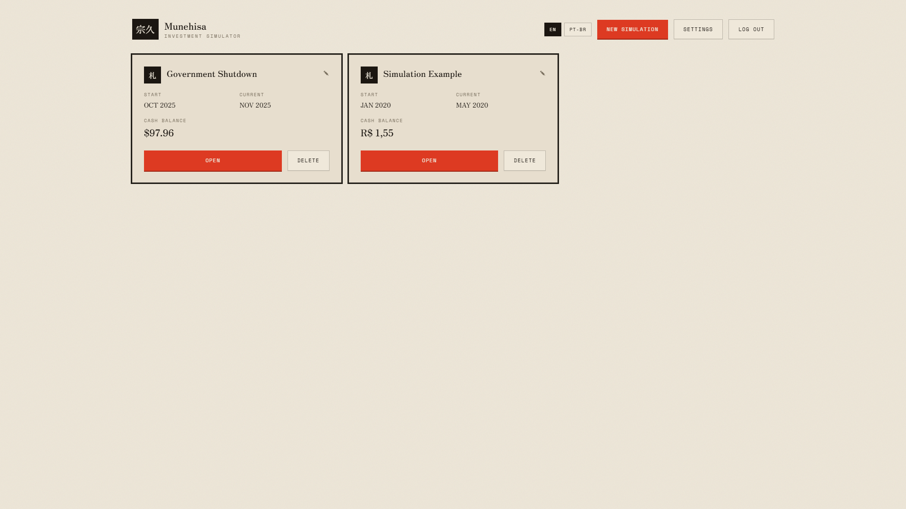
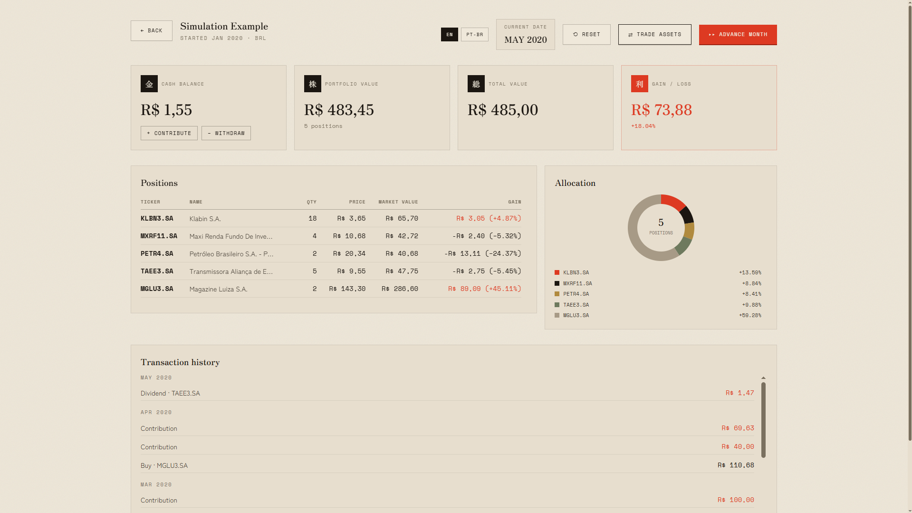
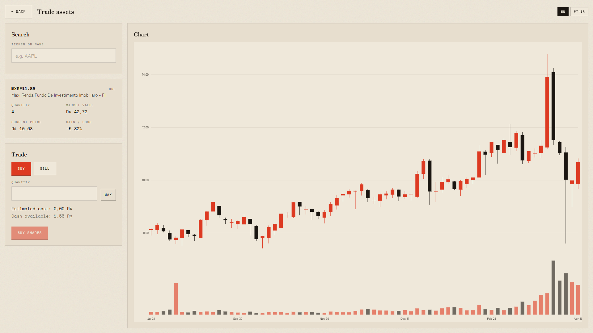

[](https://github.com/HernaniSamuel/munehisa-investment-simulator/actions/workflows/ci.yml)

# Munehisa Investment Simulator

A risk-free investment simulator: create a simulation, pick a historical starting month and a
base currency, and trade real historical prices month by month to see how a strategy would
actually have played out — no real money, no real risk. The name is written **宗久**
(Munehisa) — 宗 (*mune*) for foundation/principle, 久 (*hisa*) for long-lasting/enduring —
chosen to mirror the project's own framing of investing as a long-term, buy-and-hold practice
rather than short-term speculation, and as a nod to **Munehisa Homma** (Sokyu Honma), the
18th-century Japanese rice merchant credited as the father of candlestick chart analysis, whose
techniques still power the price chart this simulator trades against.

## Screenshots

### Simulations list
Every simulation a user has created, with its date range and cash balance at a glance.



### Simulation dashboard
KPIs (cash balance, portfolio value, total value, gain/loss), current positions, allocation
breakdown, and transaction history for one simulation.



### Trade screen
Asset search, an interactive candlestick price chart, and the buy/sell form.



## Live demo

**[hernanisamuel.github.io/munehisa-investment-simulator](https://hernanisamuel.github.io/munehisa-investment-simulator/)**

The frontend is static (GitHub Pages) and backed by a live Spring Boot API hosted on a Hetzner
Cloud VM (see [ADR-0011](docs/adr/0011-hetzner-hosting-self-hosted-postgres.md)).

## Features

- **Account registration with email verification**, JWT-based login, and password reset by
  email (`POST /auth/register`, `GET /auth/verify`, `POST /auth/login`,
  `POST /auth/forgot-password`, `POST /auth/reset-password` — `AuthController`).
- **Simulation creation** with a chosen start month and base currency, restricted to **USD/BRL**
  (`POST /simulations` — `SimulationController`; see
  [business-rule-0006](docs/business-rules/0006-usd-brl-only-base-currencies.md)).
- **Monthly time-step advancement** through historical market data
  (`POST /simulations/{id}/advance`; see
  [business-rule-0002](docs/business-rules/0002-monthly-simulation-time-step.md)).
- **Buy/sell trading** against real historical prices
  (`POST /simulations/{id}/buy`, `/sell`).
- **Deposits and withdrawals**, with an optional inflation-adjusted **"today's money"** mode
  that converts a present-day amount to its nominal value for the simulation's current month
  (`POST /simulations/{id}/deposits`, `/withdrawals`; see
  [business-rule-0007](docs/business-rules/0007-todays-money-deposit-withdrawal-deflation.md)).
- **Portfolio snapshots and reset-to-snapshot**, a one-step undo back to the most recent
  month-end (`POST /simulations/{id}/snapshot`, `/reset`; see
  [business-rule-0013](docs/business-rules/0013-single-overwritten-snapshot.md)).
- **A dashboard** with KPIs, a positions table, and an allocation breakdown
  (`simulation-dashboard.tsx`).
- **An interactive candlestick price chart** per asset (`trade.tsx`, built with D3).
- **English/Portuguese (pt-BR) localization** throughout the UI (`react-i18next`).
- **Light/dark theming** — Sumi (light, default) and Zankyō (dark) — switchable per user
  (`settings.tsx`).

## Tech stack

**Backend** (`src/backend`)
- **Java 21** / **Spring Boot 4.1** (Web MVC, Spring Security, Spring Data JPA, Validation, Mail)
- **PostgreSQL 16**, schema-versioned with **Flyway**
- **JWT** (`com.auth0:java-jwt`) for stateless authentication
- **Docker** / **Docker Compose** for local Postgres + pgAdmin
- **JUnit 5**, **Mockito**, and **Testcontainers** for unit and integration tests
- **GitHub Actions** for CI (build → unit tests → integration tests)
- **springdoc-openapi** for interactive API docs (Swagger UI)

**Frontend** (`src/frontend`)
- **React 19** + **React Router 8** (framework mode, SPA build — no Node server at runtime)
- **Tailwind CSS 4**
- **TypeScript**
- **D3** for the candlestick chart, **i18next**/**react-i18next** for localization

**Data service** (`src/data-service`)
- **Python 3.14** / **FastAPI** + **Pydantic v2**
- **yfinance** / **pandas** for fetching and resampling market data
- **python-bcb** (BRL inflation, BCB) and **requests** against FRED (USD inflation)
- **pytest**, **ruff**, **mypy**

See [ADR-0004](docs/adr/0004-python-data-service.md) for why market-data fetching is a separate
Python service rather than living inside the Java backend.

## Architecture

Three modules: the backend (`src/backend`, documented in this file), the frontend
([`src/frontend/README.md`](src/frontend/README.md)), and the data-service
([`src/data-service/README.md`](src/data-service/README.md)). The frontend talks to the
backend's REST API; the backend calls the data-service synchronously, over an internal network,
for any market/exchange/inflation data it doesn't already have cached, and owns everything
downstream of that raw data (positions, cost basis, cash balances). The data-service holds no
state of its own beyond a short-lived in-memory cache.

The backend itself is a single Maven module, organized by responsibility:

```
controllers/   REST endpoints (HTTP concerns only, delegate to services)
service/       Business logic
repository/    Spring Data JPA repositories
domain/        JPA entities
dto/           Request/response records - entities are never exposed directly
exceptions/    Domain-specific exceptions, mapped to HTTP statuses by infra/RestExceptionHandler
infra/         Cross-cutting config: security (JWT filter, Spring Security), CORS, OpenAPI, error handling
```

Request flow: `Controller → Service → Repository`. Business rules and validation live in the
service layer, which is covered by pure Mockito unit tests; `Controller` + `Repository` behavior
is covered by Testcontainers-backed integration tests that run against a real PostgreSQL
instance.

The full rationale behind these choices — and every other architecturally significant decision —
is logged in [docs/adr/](docs/adr/README.md).

## Documentation

How this project was built, and why:

- [docs/adr/](docs/adr/README.md) — Architecture Decision Records: the technical decisions
  that were costly to reverse or chosen over a real alternative.
- [docs/business-rules/](docs/business-rules/README.md) — Business Rule Decision Records: the
  domain/behavioral choices that shape how the simulation and financial logic actually behave.
- [CONTRIBUTING.md](CONTRIBUTING.md) — branch naming, commit format, PR/review flow, merge
  strategy.
- [docs/ai-workflow/](docs/ai-workflow/README.md) — the role prompts used to carry out parts of
  this workflow with an AI assistant.

## Known limitations

- **No fees, taxes, or slippage are modeled** — every trade executes at exactly
  `quantity × price × exchange rate` (see
  [business-rule-0005](docs/business-rules/0005-no-fees-taxes-or-slippage-modeled.md)).
- **No backup strategy exists yet** for the self-hosted production Postgres instance (see
  [ADR-0011](docs/adr/0011-hetzner-hosting-self-hosted-postgres.md)).
- **Only USD and BRL are supported** as simulation base currencies, gated on inflation-index
  data availability (see
  [business-rule-0006](docs/business-rules/0006-usd-brl-only-base-currencies.md)).

## Getting started

### Running locally

**Prerequisites:** JDK 21, Docker (with Docker Compose), and the Maven wrapper (already vendored, no local Maven install needed).

1. Copy the environment template and fill in your own values. It's needed in two places, since `docker compose` reads `.env` from the repo root while the backend app reads it from `src/backend/.env`:
   ```
   cp src/backend/.env.example .env
   cp src/backend/.env.example src/backend/.env
   ```
   Every value must be filled for the app to start: `EMAIL_PASSWORD` and `JWT_SECRET` have no defaults and are required by the backend; `POSTGRES_USER`/`POSTGRES_PASSWORD`/`POSTGRES_DB`/`POSTGRES_PORT` and `PGADMIN_DEFAULT_EMAIL`/`PGADMIN_DEFAULT_PASSWORD`/`PGADMIN_PORT` are required by Docker Compose (root `.env`) and must match the values used in `src/backend/.env`. Everything else in the template is optional and already has a sane default.
2. Start Postgres (and pgAdmin, optional) via Docker Compose:
   ```
   docker compose up -d
   ```
3. Run the backend:
   ```
   cd src/backend
   ./mvnw spring-boot:run
   ```
   The API listens on `http://localhost:8000` by default.

For the frontend and the data-service, see their own READMEs:
[`src/frontend/README.md`](src/frontend/README.md) and
[`src/data-service/README.md`](src/data-service/README.md).

#### API docs (Swagger UI)

Enabled by default when running with the `dev` profile (the default), no extra configuration needed - just open:

```
http://localhost:8000/swagger-ui.html
```

It's disabled by default in any other profile, including `prod` (see below). Set
`SWAGGER_UI_ENABLED=false` in `.env` to opt out even in dev.

### Production configuration

Running the backend with `SPRING_PROFILES_ACTIVE=prod` picks up
`application-prod.properties` instead of the dev config, and requires a couple of env vars
that have no equivalent in local/dev use:

- `FRONTEND_URL` - **required, no default.** Unlike dev (which falls back to
  `http://localhost:5173`), starting in `prod` without it set fails immediately instead of
  silently emailing verification/password-reset links to `localhost`.
- `CORS_ALLOWED_ORIGINS` - optional, defaults to the GitHub Pages frontend
  (`https://hernanisamuel.github.io`). Override it if the production frontend origin changes.

The Actuator surface is also locked down in `prod`: only `GET /actuator/health` is exposed
(no `/env`, `/beans`, etc.), and Swagger/OpenAPI stay off unless `SWAGGER_UI_ENABLED=true` is
set explicitly, same as any non-dev profile.

### Running the full stack with Docker Compose

For integration/load testing, or to preview the container shape each service will run in on
a future hosting platform, Docker Compose can also build and run Postgres, the backend, and
the data-service together:

```
docker compose up --build
```

This is not a replacement for day-to-day development - `./mvnw spring-boot:run` and
`uvicorn --reload` (see [`src/data-service/README.md`](src/data-service/README.md)) stay the
faster, hot-reloading way to work on either service. It's meant for exercising the
production-shaped images (multi-stage builds, non-root users, health checks) end to end.

Besides the root `.env` (read by Docker Compose itself, for `postgres`/`pgadmin`), the
`backend` and `data-service` containers each read their own `.env` file
(`src/backend/.env` and `src/data-service/.env` respectively - the same files
`./mvnw spring-boot:run` and `uvicorn`/`python -m data_service.main` already require). Fill
in all three before running `docker compose up --build`. `POSTGRES_HOST` and
`DATA_SERVICE_BASE_URL` don't need to be set in `src/backend/.env` for this flow - Compose
sets them itself so `backend` can reach `postgres` and `data-service` by their Compose
service names.

The backend is published on `http://localhost:8000` as usual. The data-service is *not*
published to the host - it's only reachable from `backend` on the Compose network, consistent
with its "the API key is the only thing standing between this service and any request that
reaches it" posture (see [`src/data-service/README.md`](src/data-service/README.md)).

### Running tests

```
cd src/backend
./mvnw test -DexcludedGroups=integration   # fast, no Docker required
./mvnw test -Dgroups=integration           # needs Docker running (Testcontainers)
```

See [`src/frontend/README.md`](src/frontend/README.md#verifying-changes) and
[`src/data-service/README.md`](src/data-service/README.md) for the frontend and data-service
test commands.

## License

MIT — see [LICENCE](LICENCE).

## About the author

**Hernani Samuel Diniz**

[LinkedIn](https://www.linkedin.com/in/hernanisamueldiniz/) ·
[Portfolio](https://hernanisamuel.github.io/meu_portfolio/) ·
[hernanisamuel0@gmail.com](mailto:hernanisamuel0@gmail.com)

## Contributing

See [CONTRIBUTING.md](CONTRIBUTING.md) for branch naming, commit message format, PR/review flow,
and merge strategy. Issues use the template at
[.github/ISSUE_TEMPLATE.md](.github/ISSUE_TEMPLATE.md); PRs use the template at
[.github/PULL_REQUEST_TEMPLATE.md](.github/PULL_REQUEST_TEMPLATE.md). Parts of this workflow can
be carried out by an AI assistant using the role prompts in
[docs/ai-workflow/](docs/ai-workflow/README.md).
